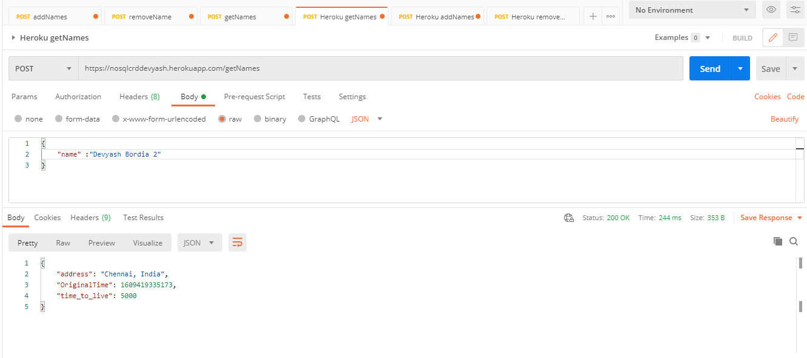
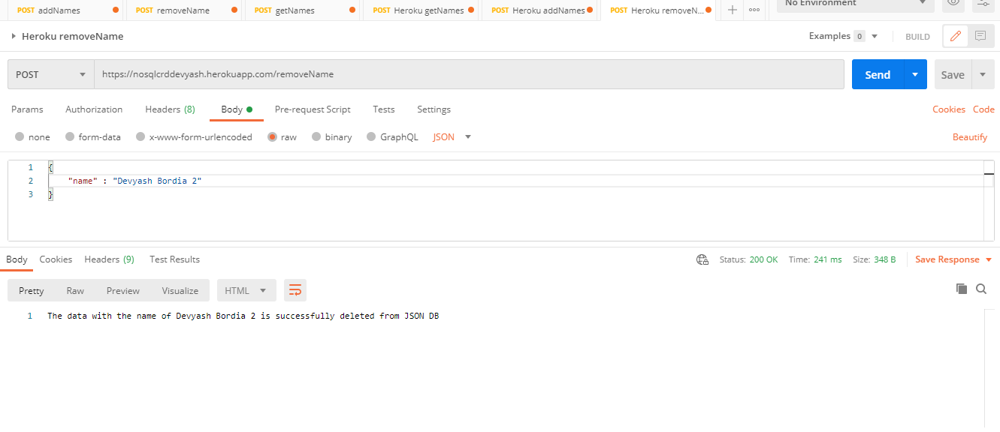

## Deloyment

- I have deployed this app on Heroku

  > https://nosqlcrddevyash.herokuapp.com/

## How to Install Locally

1. Clone the Repository

   > git clone https://github.com/ThatDevCoder/nosql-kv-db.git

2. cd into the directory and install node_modules

   > npm install

3. Spin up the server

   > npm run start

   OR

   > npm run nodemon

## EndPoints

- Had exposed 3 endpoints

  - addNames
  - getName
  - removeNames

  We can use Postman to test our endpoints

1. addNames

   > https://nosqlcrddevyash.herokuapp.com/addNames

   The POST data must be in JSON format

   - In postman create a `POST` request and In body fill the details in `raw` and `JSON` format

   ```
   {
    "name": {nameKey}  // Capped at 16 Chars
    "address": {addressKey}  //Capped at 16000 chars
    "time_to_live": {time_to_live}  //Integer in seconds
   }
   ```

   

   - We had set the time-to-live as 5000 seconds. After that we can't access/ get the name and we cannot also remove the name. If we are not providing time-to-live key it will be set to never expiring or -1.

2. getNames

   > https://nosqlcrddevyash.herokuapp.com/getNames

   The POST data must be in JSON format

   - In postman create a `POST` request and In body fill the details in `raw` and `JSON` format

   ```
   {
      "name" : "Name To Be searched"
   }
   ```

   

3. removeName

   > https://nosqlcrddevyash.herokuapp.com/removeName

   The POST data must be in JSON format

   - In postman create a `POST` request and In body fill the details in `raw` and `JSON` format

   ```
   {
      "name" : "Name To Be deleted"
   }
   ```

   

## Language used

- `Javascript and Nodejs (Express)`

## OS Environment

- Windows
